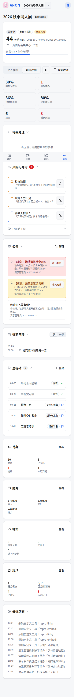
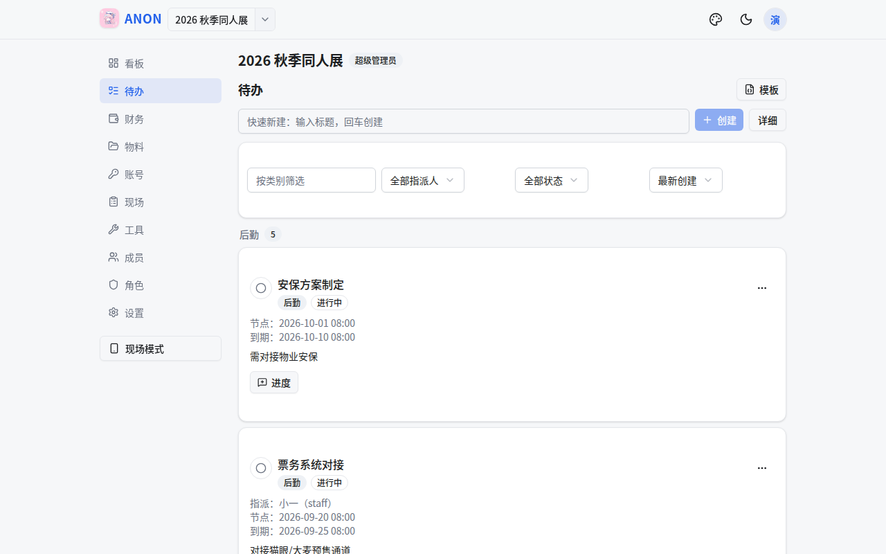
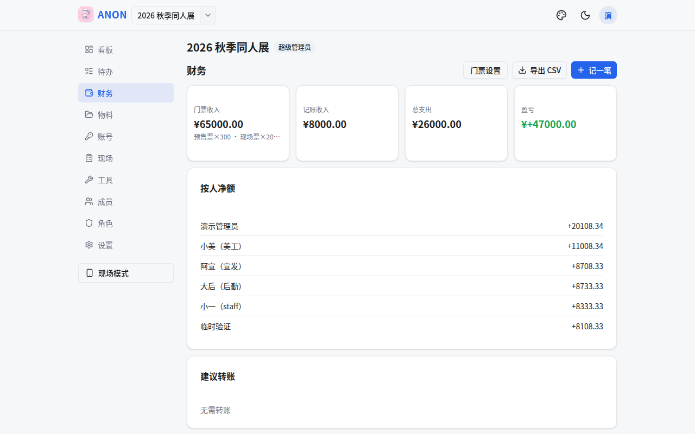
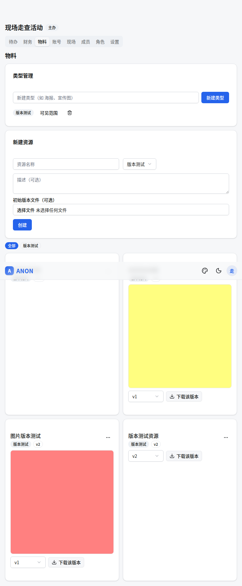
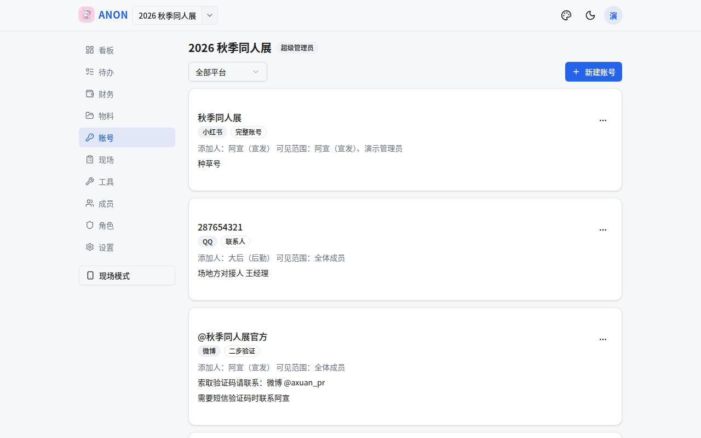
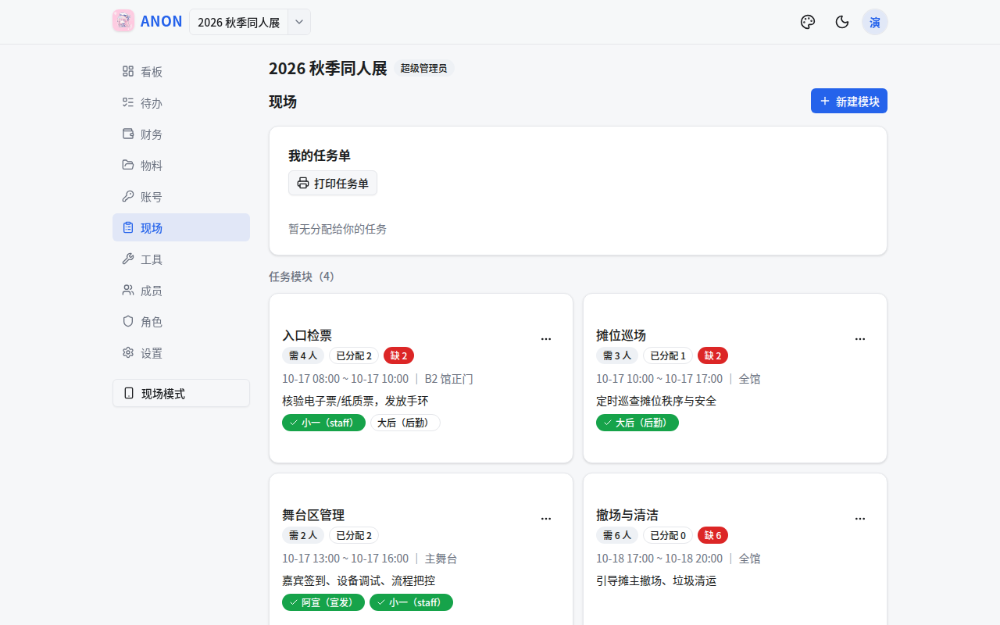
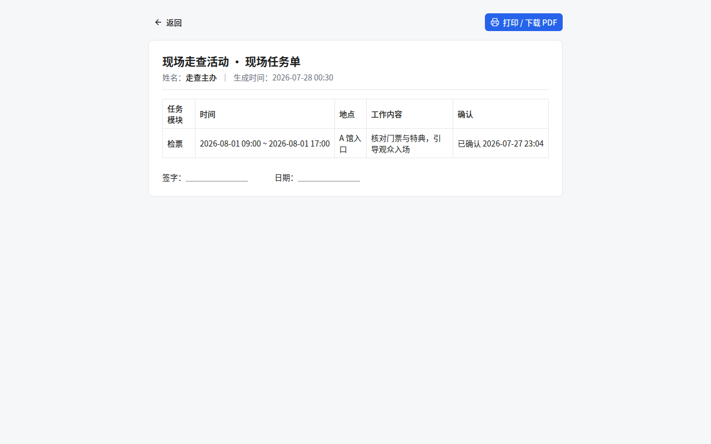
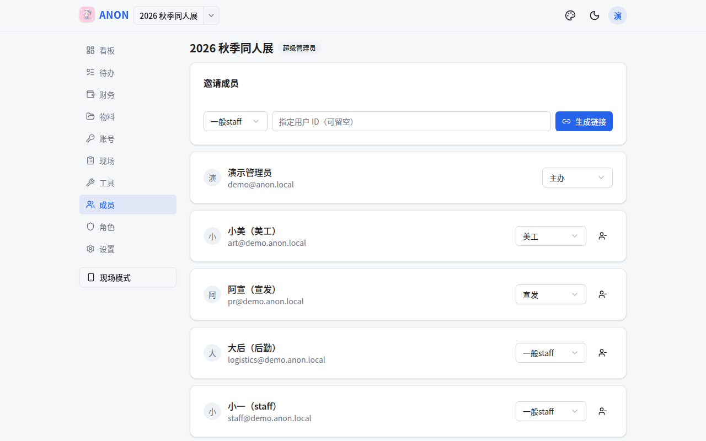

# ANON

[](LICENSE)

面向活动（展会、同人活动、演出等）组织团队的全流程追踪与协作工具。以「项目」为单位组织协作，覆盖项目看板、任务进度、财务收支、物料文件、平台账号与现场分工六大场景，移动端优先。

> **名字由来**：**A**ctivities, **N**eatly **O**rganized & **N**oted——「活动，被井然地组织与记录」。也呼应 *anonymous*：平台账号密码默认在浏览器端加密，服务端零明文。

## 功能与界面

### 看板：项目总览

进入项目后的默认首页。聚合展示活动倒计时、项目健康度、待我处理事项、自动风险检测（人员不足/待办逾期/超预算等）、关键指标、近期日程与各模块摘要，一屏掌握项目全貌。

- **快捷操作**：待我处理列表直接完成待办、确认现场任务，无需跳转
- **风险闭环**：管理者可忽略风险（需填原因+选期限），修复后自动解除
- **公告系统**：发布普通/重要/紧急公告，支持确认机制和可见范围
- **最近动态**：操作审计流，继承原记录权限过滤
- **视图切换**：个人视图 / 项目视图，卡片可折叠，偏好自动保存
- **阶段管理**：8 阶段预设模板，看板头部进度条，设置页可增删改排
- **里程碑**：关键时间节点管理，自动集成到日程时间线，到期前邮件提醒
- **多项目总览**：项目列表显示健康状态、待办进度、阶段进度、风险数



### 待办：进度追踪

快速创建（标题回车即建）与详细表单，按类别分组列表；日期字段支持按「开展前 N 天」倒排录入（保存为绝对日期，不联动重算）；完成前可多次提交进度（备注+附件）形成时间线，完成后卡片一键直达完成；编辑/重新打开、筛选排序、导出模板与按新项目日期一键批量生成一应俱全。



### 财务：收支与结算

多票种门票设置、收支记账（可传凭证）、按人净额与最简转账建议、按成员导出 CSV。



### 物料：文件与版本管理

资源类型与多版本管理，图片自动生成 WebP 预览，PDF/Markdown/音视频支持在线预览；切换版本时预览图随之更新；新建资源时可直接上传初始版本。类型/资源均可设可见范围。



### 账号：平台账号管理

三种记录模式（完整账号 / OTP 辅助 / 联系人）；密码默认浏览器端 AES-GCM 加密，服务端零明文。



### 现场：任务分工与任务单

建任务模块（时间/地点/所需人力）并分配到人，成员在线确认；一键生成可打印任务单（含签字栏，可另存 PDF，支持全员连排）。





### 成员与权限

邀请链接入项、预置/自定义角色与权限点；界面按权限过滤——成员只看到自己有权限的 Tab 与按钮。安全特性：短期访问令牌 + refresh token 滚动轮换（30 天）、登录限流防撞库、安全响应头（CSP/nosniff/X-Frame-Options）、实物清单变动审计需 `materials:manage` 权限。



### 工具：舞台时间编排 + 报名审核 + 失物招领 + 自定义工具接入

录入节目（名称/时长/参与者 CN/素材文件），自动推算每个节目的起止时间；拖动或键盘快速排序，一键导出高清 PNG 表格（勾选列、长文本自动换行）与纯文本 rundown。演出当天进入**执行模式**：当前节目追踪、延误/提前与超时提示、一键顺延后续节目，执行中锁定编排；「现场大屏」生成免登录深色投屏页（当前节目特大字 + 时钟 + 紧急公告位，10 秒自动刷新，联系方式/备注/附件不上屏），现场模式页还有「舞台执行」卡可就地开始/推进/顺延。报名审核工具按批次收集报名节目，按名称排序暴露撞名，勾选实时预览合计时长与预计起止，成员投票（赞成/反对 + 意见）后由管理者拍板，已通过节目一键追加进既有 Rundown。失物招领工具登记现场捡到物品（照片/捡到地点）并跟踪认领状态，可一键开启免登录公开查找页（随机链接、可关闭可重置），观众扫码即可自助查失物；现场模式页也有失物登记卡片，捡到即录。

可登记自研独立组件为项目自定义工具（页内 iframe 嵌入或新标签页打开，`tools:manage` 管理）；开启「携带用户身份」后组件经短期启动令牌兑换 30 天 API 密钥（OpenAPI 模式，权限按勾选权限点 ∩ 用户角色实时收窄），「我的」页还可自助生成 30 天/永久 API 密钥供自动化脚本使用。

### 通知：邮件 + Web Push

统一通知管线驱动邮件与浏览器推送双渠道：被指派/改派待办、待办完成、现场任务分配、重要/紧急公告即时通知，异常上报与新风险直达管理者；待办节点/到期、里程碑临近、每周周报由 cron 统一提醒。配置 VAPID 后推送直达设备通知栏，点击跳转对应页面；未配置时静默回退纯邮件。

### 更多体验

试用模式（`admin@test.com` + 任意 ≥8 位密码即建独立演示环境，24h 自动销毁，全站「试用」横幅标识）、纯前端演示站（`npm run build:demo` 一键构建 Cloudflare Pages 预览站，浏览器内 mock 数据、访客免登录、修改会话内保留）、双风格主题（简洁/明快 × 日/夜）、新手引导（欢迎幻灯 + 界面导览）、内置图文帮助文档（/help）、移动端优先布局（顶栏 Logo/项目名直回当前看板 + 项目切换器含「查看全部项目」、项目内桌面左侧边栏 / 移动端底部固定栏 + 更多弹窗，Tab 状态写入 URL 可分享、可前进后退）。

## 技术栈

- **后端**：Express 4 + TypeScript + MongoDB（Mongoose 8），JWT 鉴权（15 分钟 access + 轮换 refresh），登录限流，vitest + mongodb-memory-server
- **前端**：Vite 6 + React 18 + TypeScript + Tailwind CSS v4 + shadcn/ui（Radix）+ lucide-react + sonner

## 快速开始

```bash
docker compose up -d                                  # 启动 MongoDB（或用自有 MongoDB）
cp backend/.env.example backend/.env                  # 配置 JWT_SECRET / SUPER_ADMIN_EMAIL
cd backend && npm install && npm run dev              # 后端 :4000
cd frontend && npm install && npm run dev             # 前端 :5173（/api 代理到 4000）
```

浏览器打开 http://localhost:5173 ，用 `SUPER_ADMIN_EMAIL` 注册首个账号（自动成为超管）→「管理」页创建邀请码 → 成员凭码注册。

详细部署与环境变量说明见 [docs/readme.md](docs/readme.md)。

## Docker 部署（推荐）

无需 Node 环境，一条命令拉起整栈（内嵌数据库 FerretDB+PostgreSQL、内嵌对象存储 MinIO、backend、frontend）：

```bash
echo "JWT_SECRET=$(openssl rand -hex 32)" > .env   # 必填，可选 SMTP 等见 docs/readme.md
docker compose -f docker-compose.prod.yml up -d --build
# 访问 http://localhost:8080（WEB_PORT 可改对外端口）
```

前端 nginx 托管静态文件并代理 `/api`（唯一对外端口）；默认使用内嵌 FerretDB（MongoDB 协议 + PostgreSQL/DocumentDB 存储，零外部依赖），在 `.env` 设 `MONGO_URI` 可切换为外接 MongoDB；数据存于 named volumes（`pg-data` / `uploads-data` / `minio-data`）。更多说明（数据库两级配置、日志、停止、单独构建镜像、cron 提醒）见 [docs/readme.md](docs/readme.md) 的「Docker 部署」节。

## 文档

- [docs/readme.md](docs/readme.md) — 部署、环境变量、cron 提醒、测试与冒烟
- [docs/features.md](docs/features.md) — 功能使用指南
- [docs/api.md](docs/api.md) — 接口契约
- [docs/plugin-development.md](docs/plugin-development.md) — 插件开发指南（自定义工具接入 + OpenAPI 模式对接）
- [docs/design.md](docs/design.md) — 设计说明与变更记录
- [docs/demo-site.md](docs/demo-site.md) — 纯前端演示站（Cloudflare Pages）：构建部署、mock 内核与会话保留语义

## 贡献

欢迎 Issue 与 PR。开发约定：后端改动需 `npm test`（vitest）与 `npm run typecheck` 全绿；前端需 `npm run build` 通过；提交信息使用 Conventional Commits 风格。依赖变更需过依赖扫描 CI（osv-scanner，见 `.github/workflows/dependency-scan.yml`）。

## 许可证

[MIT](LICENSE) © 2026 ShiratsuyuClassYuudachi
