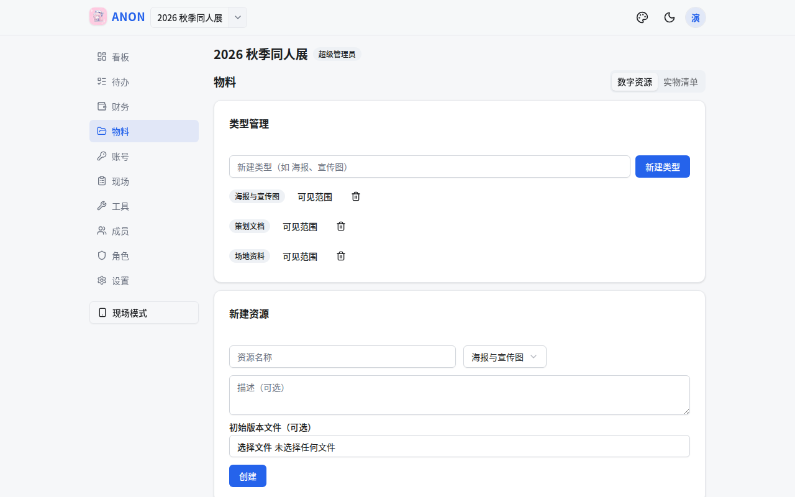

# ANON

[](LICENSE)

面向活动（展会、同人活动、演出等）组织团队的全流程追踪与协作工具。以「项目」为单位组织协作，覆盖任务进度、财务收支、物料文件、平台账号与现场分工五大场景，移动端优先。

> **名字由来**：**A**ctivities, **N**eatly **O**rganized & **N**oted——「活动，被井然地组织与记录」。也呼应 *anonymous*：平台账号密码默认在浏览器端加密，服务端零明文。

> **开发方式**：本项目从架构设计、编码实现到测试走查完全由 Kimi K3（AI）完成，人类负责需求定义与最终验收。

## 功能与界面

### 待办：进度追踪

类别/指派人/状态筛选与排序，完成时可填备注并上传附件；支持导出模板、按新项目日期一键批量生成。


### 财务：收支与结算

多票种门票设置、收支记账（可传凭证）、按人净额与最简转账建议、按成员导出 CSV。


### 物料：文件与版本管理

资源类型与多版本管理，图片自动生成 WebP 预览；类型/资源均可设可见范围。



### 账号：平台账号管理

三种记录模式（完整账号 / OTP 辅助 / 联系人）；密码默认浏览器端 AES-GCM 加密，服务端零明文。


### 现场：任务分工与任务单

建任务模块（时间/地点/所需人力）并分配到人，成员在线确认；一键生成可打印任务单（含签字栏，可另存 PDF，支持全员连排）。


### 成员与权限

邀请链接入项、预置/自定义角色与权限点；界面按权限过滤——成员只看到自己有权限的 Tab 与按钮。


### 更多体验

双风格主题（简洁/明快 × 日/夜）、新手引导（欢迎幻灯 + 界面导览）、内置图文帮助文档（/help）、移动端优先布局。

## 技术栈

- **后端**：Express 4 + TypeScript + MongoDB（Mongoose 8），JWT 鉴权，vitest + mongodb-memory-server
- **前端**：Vite 5 + React 18 + TypeScript + Tailwind CSS v4 + shadcn/ui（Radix）+ lucide-react + sonner

## 快速开始

```bash
docker compose up -d                                  # 启动 MongoDB（或用自有 MongoDB）
cp backend/.env.example backend/.env                  # 配置 JWT_SECRET / SUPER_ADMIN_EMAIL
cd backend && npm install && npm run dev              # 后端 :4000
cd frontend && npm install && npm run dev             # 前端 :5173（/api 代理到 4000）
```

浏览器打开 http://localhost:5173 ，用 `SUPER_ADMIN_EMAIL` 注册首个账号（自动成为超管）→「管理」页创建邀请码 → 成员凭码注册。

详细部署与环境变量说明见 [docs/readme.md](docs/readme.md)。

## Docker 部署（推荐）

无需 Node 环境，一条命令拉起 mongo + backend + frontend 整栈：

```bash
echo "JWT_SECRET=$(openssl rand -hex 32)" > .env   # 必填，可选 SMTP 等见 docs/readme.md
docker compose -f docker-compose.prod.yml up -d --build
# 访问 http://localhost:8080（WEB_PORT 可改对外端口）
```

前端 nginx 托管静态文件并代理 `/api`（唯一对外端口）；默认使用内嵌 FerretDB（MongoDB 协议 + PostgreSQL/DocumentDB 存储，零外部依赖），在 `.env` 设 `MONGO_URI` 可切换为外接 MongoDB；数据存于 named volumes（`pg-data` / `uploads-data`）。更多说明（数据库两级配置、日志、停止、单独构建镜像、cron 提醒）见 [docs/readme.md](docs/readme.md) 的「Docker 部署」节。

## 文档

- [docs/readme.md](docs/readme.md) — 部署、环境变量、cron 提醒、测试与冒烟
- [docs/features.md](docs/features.md) — 功能使用指南
- [docs/api.md](docs/api.md) — 接口契约
- [docs/design.md](docs/design.md) — 设计说明与变更记录

## 贡献

欢迎 Issue 与 PR。开发约定：后端改动需 `npm test`（vitest）与 `npm run typecheck` 全绿；前端需 `npm run build` 通过；提交信息使用 Conventional Commits 风格。

## 许可证

[MIT](LICENSE) © 2026 ShiratsuyuClassYuudachi
