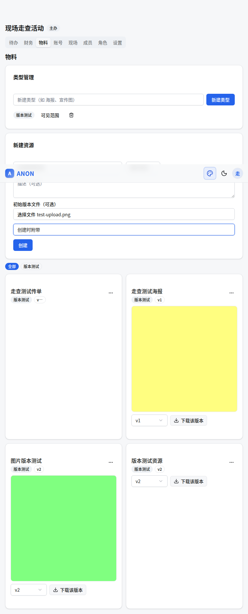

# ANON 功能介绍与使用指南

ANON 是一个面向活动（展会、同人活动、演出等）组织团队的全流程追踪与管理工具。系统以「项目」为单位组织协作，覆盖项目看板、任务进度、财务收支、物料文件、平台账号与现场分工六大场景，支持移动端优先的 Web 访问。

- 技术栈：Express + TypeScript + MongoDB（后端），Vite + React + TypeScript（前端）
- 接口契约见 `docs/api.md`，部署与运维见 `docs/readme.md`

**目录**

1. [快速上手（第一次使用）](#快速上手第一次使用)
2. [项目看板](#项目看板)
3. [账号与权限](#账号与权限)
4. [进度追踪（待办）](#进度追踪待办)
5. [财务模块](#财务模块)
6. [物料管理](#物料管理)
7. [平台账号管理](#平台账号管理)
8. [现场任务单](#现场任务单)
9. [新手引导与帮助文档](#新手引导与帮助文档)
10. [界面与体验](#界面与体验)
11. [安全设计摘要](#安全设计摘要)

---

## 快速上手（第一次使用）

按以下顺序走一遍，即可完成团队初始化：

1. **部署启动**（见 `docs/readme.md`）：启动 MongoDB → 配置 `backend/.env`（重点填 `JWT_SECRET`、`SUPER_ADMIN_EMAIL`）→ 启动后端 → 启动前端
2. **注册超级管理员**：打开前端页面 → 「使用邀请码注册」→ 用 `SUPER_ADMIN_EMAIL` 配置的邮箱注册（邀请码留空）。这是全站第一个账号，自动成为超级管理员
3. **创建邀请码**：登录后进入顶部「管理」页 → 输入自定义邀请码或留空自动生成 → 把邀请码分发给团队成员
4. **成员注册**：成员打开注册页，填写邀请码 + 邮箱 + 昵称 + 密码
5. **创建项目**：进入「项目」页 → 填写项目名称（可同时填开始/结束日期）→ 创建。创建者自动成为「主办」
6. **邀请成员进项目**：进入项目 → 「成员」Tab → 选择角色 → 「生成链接」→ 把链接发给对方。对方登录后打开链接点「接受邀请」即加入
7. **开始使用**：按需进入 待办 / 财务 / 物料 / 账号 各 Tab 工作

> 提示：邀请链接分两种——「指定用户 ID」的链接只有该用户能接受；留空则是开放链接，任何登录用户可接受（一次性，默认 72 小时有效）。

---

## 项目看板

进入项目后默认展示「看板」Tab，一屏纵览项目全貌，所有成员可见。

### 项目头部

显示项目名称、状态徽章（筹备中 / 进行中 / 已结束）、大数字开展倒计时、阶段与地点。未开始时显示「N 天后开展」，进行中显示「第 N 天」，已结束显示「N 天前结束」，完整日期范围以小字附在倒计时旁。倒计时颜色随紧迫度变化：正常 → 警告（≤7 天）→ 进行中 → 已结束。项目列表卡片上的日期区间同样以倒计时文案展示。

### 待我处理

聚合当前用户未完成且指派给自己的待办，以及尚未确认的现场任务分配。每条显示来源图标、标题、到期时间；逾期条目带红色标记。点击可跳转到对应 Tab 处理。

每条事项右侧提供快捷操作按钮：待办显示「完成」（弹出备注+附件表单），现场任务显示「确认」（一键确认分配）。操作完成后看板数据自动刷新。

### 风险与异常

系统自动扫描各模块数据，检测潜在风险：

| 风险规则 | 触发条件 |
| --- | --- |
| 待办逾期 | 有未完成待办超过到期时间 |
| 待办无指派人 | 待办创建后未分配任何人 |
| 批量未完成 | 距活动开始 ≤7 天但完成率 < 50% |
| 预算超支 | 总支出超过总收入 |
| 现场人力不足 | 模块已分配人数 < 所需人力 |
| 现场无人分配 | 模块创建后未分配任何人 |
| 临期未确认 | 距活动 ≤3 天仍有未确认的现场分配 |
| 物料无版本 | 资源创建后未上传任何文件 |

风险按严重程度排序（critical > warning > info），顶部显示项目健康状态徽章（正常 / 需关注 / 有风险 / 严重）。管理者可对风险执行「忽略」操作（需填写原因，并选择忽略期限：1 天 / 至活动开始 / 永久忽略）或「恢复」操作。已忽略的风险在看板折叠区展示，可展开查看原因和恢复。

### 指标网格

以卡片形式展示关键数字：待办完成率、逾期待办数、项目盈亏、现场确认率、成员数、活跃风险数。点击卡片跳转到对应功能 Tab。财务指标仅对有 `finance:add` 或 `finance:manage` 权限的成员展示。

### 日程（未来 7 天）

按日期分组展示即将到期的待办与即将开始的现场任务，日期标签为「今天」「明天」或「MM-DD」格式。

### 模块摘要

底部 2×2 卡片概览各模块状态：待办（总数/已完成）、财务（盈亏，权限过滤）、物料（类型数/资源数）、现场（模块数/确认率）。点击卡片跳转。

### 公告

管理者（`announcement:manage` 或 `project:manage`）可发布公告，支持三种类型：

| 类型 | 样式 | 典型用途 |
| --- | --- | --- |
| 普通 | 默认边框 | 日常通知 |
| 重要 | 橙色边框 | 需关注但不紧急 |
| 紧急 | 红色边框 | 现场紧急通知 |

公告功能：
- **确认机制**：发布时勾选「需要确认」，成员看到后点「我已知悉」，发布者可查看已确认/未确认名单
- **可见范围**：可限制为指定成员或角色（复用物料模块的可见性模型）
- **置顶**：置顶公告始终排在列表最前
- **过期**：设置过期时间后自动从看板隐藏

### 最近动态

看板底部展示项目操作审计流，记录类型包括：创建/完成/修改/删除待办、添加/修改/删除财务记录、创建资源/上传版本、创建/调整/删除现场任务、确认现场分配、发布公告、项目状态变更、成员移除。

动态内容继承原记录权限——标记为 `finance:manage` 的动态仅对有财务权限的成员可见。记录保留 90 天后自动清理（TTL 索引）。

### 视图切换与个性化

- **视图切换**：顶部「个人视图」/「项目视图」切换按钮。个人视图聚焦待我处理与个人日程；项目视图额外展示指标网格与模块摘要，侧重全局风险与统计。默认值根据角色自动设定（管理者默认项目视图，普通成员默认个人视图）
- **卡片折叠**：每个卡片区域标题栏有折叠按钮，折叠状态自动保存到服务端
- **自定义看板**：视图切换旁的设置按钮打开自定义面板，可调整卡片显示顺序（上移/下移）或隐藏不需要的卡片，随时可恢复
- **日程范围**：支持 7 天 / 30 天切换
- 偏好按用户×项目维度持久化，跨设备生效

### 阶段管理

项目头部展示阶段进度（桌面端步进器 / 移动端进度条）。新建项目时自动填充 8 个预设阶段：

> 立项 → 策划 → 宣发与招募 → 制作与采购 → 行前准备 → 现场执行 → 财务结算 → 复盘归档

管理者可在「设置」Tab 中：
- 添加自定义阶段、删除阶段
- 上下移动调整顺序
- 标记阶段完成或取消完成
- 为阶段添加备注

阶段进度同步显示在项目列表卡片上。

### 里程碑

里程碑是关键时间节点（如「物料交付截止」「场地确认」），独立于待办管理。

- 管理者在看板「里程碑」卡片中新建：填写标题、日期，可选关联阶段
- 未完成的里程碑自动出现在「近期日程」时间线（紫色旗帜图标）
- 支持标记完成、编辑、删除
- 到期前 3 天自动向项目管理者发送提醒邮件（需配置 SMTP + CRON_SECRET）

### 自动提醒与周报

- **待办提醒**：已有的节点提醒和到期提醒（通过 crontab 调用 `POST /api/cron/reminders`）
- **里程碑提醒**：到期前 3 天邮件通知项目管理者
- **周报**：`POST /api/cron/weekly-report` 端点，向活跃项目的管理者发送周度摘要邮件，内容包括本周完成待办数、新增风险数、当前阶段进度、下周里程碑

### 多项目总览

项目列表页（`/projects`）增强为项目驾驶舱入口，每张卡片显示：

- 健康状态圆点（绿/黄/橙/红）
- 当前阶段 Badge
- 待办完成率进度条
- 阶段进度（如 3/8）
- 活跃风险数（红色高亮）

使用聚合管道批量查询，避免 N+1 性能问题。

---

## 账号与权限

### 注册与登录

- **邀请码注册**：普通用户必须凭邀请码注册。邀请码由超级管理员在「管理」页创建，每个仅可用一次，注册时系统记录所用邀请码
- **首个超级管理员**：数据库为空时，`SUPER_ADMIN_EMAIL` 邮箱注册的第一个账号自动成为超管
- 密码 bcrypt（cost 12）哈希存储；登录态 JWT，30 天有效，过期需重新登录

### 个人资料（「我的」页）

- 修改昵称
- 维护**联系方式列表**：平台（如 QQ、微信）+ 账号，可添加多条。联系方式会展示给项目成员——尤其在平台账号需要二步验证时，其他人能快速找到你索取验证码

### 项目权限模型

- 创建项目的用户自动成为成员，角色为「主办」（全部权限）
- **预置角色**：

| 角色 | 默认权限 |
| --- | --- |
| 主办（管理） | 全部权限点 |
| 美工 | 上传文件、完成待办、记账（finance:add） |
| 宣发 | 上传文件、完成待办、记账（finance:add） |
| 一般 staff | 完成待办、记账（finance:add） |

- **自定义角色**（项目内「角色」Tab）：输入角色名 → 勾选权限点 → 创建。已有角色可勾选后「保存」修改权限；无成员使用的角色可删除
- 权限点一览：

| 权限点 | 说明 |
| --- | --- |
| `project:manage` | 项目管理（等价于全部权限） |
| `member:manage` | 成员管理（生成邀请、改角色、移除） |
| `role:manage` | 角色管理 |
| `todo:manage` | 增删改任意待办 |
| `todo:complete` | 完成指派给自己的待办 |
| `file:upload` | 上传文件 |
| `finance:manage` | 财务管理（查看/修改全部账目、门票设置、项目级汇总） |
| `finance:add` | 记账（仅可添加并管理自己添加的账目） |
| `materials:manage` | 物料管理 |
| `accounts:manage` | 账号管理 |
| `work:manage` | 现场分工管理（任务模块、分配、代确认、全员任务单） |
| `announcement:manage` | 公告管理（发布、编辑、删除公告，查看确认名单） |

### 成员管理（「成员」Tab）

- **生成邀请链接**：选择角色 →（可选）填写指定用户 ID →「生成链接」→ 复制链接发给对方
- **调整角色**：成员卡片上下拉切换角色，立即生效
- **移除成员**：点「移除」（不能移除自己）

### 可见范围

物料资源、平台账号支持设置「仅指定成员/角色可见」。**可见范围优先于权限点**：即使拥有 manage 权限，不在可见范围内也看不到该条目；超级管理员不受限。

---

## 进度追踪（待办）

### 创建待办（「待办」Tab 顶部表单）

1. 填写**标题**（必填）、**类别**（如 美工/宣发/后勤，自由文本）
2. 设置时间：**节点时间**（中间里程碑）、**到期时间**（死线）、**提醒时间**（到此时间发邮件提醒）
3. 勾选**指派人**（项目成员多选，可不选）
4. 填写备注 →「创建」

### 筛选与排序

筛选栏支持：按类别（输入）、按指派人（下拉）、按状态（进行中/已完成）；排序支持：最新创建 / 到期时间↑ / 节点时间↑。

### 完成待办

1. 点待办卡片上的「完成」
2. 填写**完成备注**（可选）、上传**附件**（凭证图片/文件，可多选）
3. 「确认完成」→ 卡片划线标记已完成，附件出现在卡片上可点击下载

> 权限：被指派人（且有 `todo:complete`）或持 `todo:manage` 的管理者可完成。完成人有记录。

### 邮件提醒

- 部署时配置 SMTP 环境变量（`SMTP_HOST/PORT/USER/PASS/FROM`）与 `CRON_SECRET`
- 用 crontab 每分钟调用一次：`curl -X POST -H "Authorization: Bearer $CRON_SECRET" http://localhost:4000/api/cron/reminders`
- 系统扫描「提醒时间已到」和「到期时间已到」的未完成待办，邮件通知全部指派人；同一待办同一类提醒只发一次
- 未配置 SMTP 时提醒只会记录日志，不影响其他功能

### 模板复用（系列活动神器）

- **导出**：「待办」Tab 底部 →「导出为模板」→ 下载 JSON（含每个待办相对项目开始/结束时间的时间偏移）
- **导入**：选择「锚定开始时间」或「锚定结束时间」→ 填新项目的锚定日期 → 选择模板 JSON 文件 →「导入模板生成待办」。系统按偏移量自动重算每个待办的节点/到期/提醒时间，批量生成

> 例：上届活动「开展前 30 天联系场地方」，本届设开始时间为 12 月 1 日导入后，自动生成 11 月 1 日到期的同名待办。

---

## 财务模块

> 权限说明：主办（或拥有 `finance:manage` 的角色）可完整管理并查看全部财务信息（含门票设置、项目级盈亏与结算汇总、按人导出 CSV）；其他身份默认仅有 `finance:add`——只能添加账目，且只能看到、修改、删除自己添加的账目，看不到项目级汇总，也无导出权限。

### 设置门票（「财务」Tab 顶部）

填写门票单价（元）与售票数量 → 保存。门票收入（单价×数量）实时计入项目盈亏。

### 记一笔账

1. 选择**类型**（支出/收入）、填写**金额**（元，两位小数）
2. 选择**实际付款人**（谁垫付/收的钱）
3. 勾选**参与平摊人**（不勾选 = 全体成员平摊；勾选 = 仅这些成员承担，不进公款池）
4. 填备注、可上传凭证附件（截图等）→ 提交

> 金额在系统内以「分」存储，结算精确到分。

### 看汇总

汇总卡片实时显示：

- **门票收入 / 记账收入 / 总支出 / 盈亏**
- **按人净额**：每个人「垫付 − 应摊 + 公款分配」后的净额。正数 = 应收回，负数 = 应付出
- **建议转账**：自动算出的最简转账列表（A 转给 B 多少钱），按此执行即可结清所有垫付与盈亏分配

> 结算口径：门票与全员收支进入「公款池」全员均摊；指定平摊人的专项支出只由平摊人承担。净额合计与现金流水严格守恒（评审经手工演算验证）。

### 按人导出 CSV（仅主办/财务管理者）

选择成员 →「导出 CSV」→ 下载该成员相关的全部账目（作为付款人、平摊人或全员账）。文件为 UTF-8 带 BOM，Excel 直接打开不乱码。

---

## 物料管理

### 建类型与资源（「物料」Tab）

1. 「新建类型」：如 海报、宣传图、场地图
2. 选择类型 →「新建资源」：如「主视觉海报」
3. **新建时可直接上传文件**：表单底部有「初始版本文件（可选）」，选择文件后会显示版本备注输入框，提交即创建资源并生成 v1，无需创建后再单独上传

### 版本管理与切换

- 每次「上传新版本」版本号 +1
- 版本下拉可切换到任意历史版本——**切换后卡片预览图、放大查看、下载均对应该版本**，方便对比历史修改
- 删除资源会级联清理所有版本与磁盘文件

### 图片预览

- 上传图片（image/*）时自动生成 **WebP 预览图**（宽 ≤800px，体积 ≤100KB）
- 列表/卡片加载预览图，速度快；**点击放大**时才加载原图

### 可见范围

- 类型或资源卡片上点「可见范围」→ 勾选成员和/或角色 → 保存
- 留空 = 全体成员可见；设置后仅勾选的成员/角色可见（资源设置优先于类型设置）
- 可见性在下载接口同样强制：被移出可见范围的成员立即无法下载原文件

---

## 平台账号管理

### 三种记录模式（「账号」Tab → 新建）

| 模式 | 记录内容 | 典型用途 |
| --- | --- | --- |
| 完整账号 | 平台 + 账号 + 密码 | 团队共用的宣传账号 |
| 仅账号（OTP 辅助） | 平台 + 账号 + 添加人 | 账号在某成员手机上，他人登录需找 TA 要短信/扫码验证码（页面直接显示 TA 的联系方式） |
| 仅联系人 | 平台 + 账号 + 备注 | 合作方、场地方等联系人记录 |

平台可选 QQ、小红书、B 站、微博、其他；列表支持按平台筛选。

### 密码的两种加密方式（完整账号模式）

- **浏览器端加密（默认，推荐）**：创建时输入你的「保险库口令」，密码在浏览器内用 PBKDF2（10 万次 SHA-256）+ AES-GCM 加密后才上传，服务端只存密文（`ANONv1:` 格式），**即使数据库泄露也无法解出密码**。查看时输入同一口令在本地解密。⚠️ 口令遗忘无法找回，请妥善保管
- **服务端密钥加密（可选）**：勾选后由服务端用环境密钥（`PLATFORM_CRYPTO_KEY`）AES-256-GCM 加密；查看时由服务端解密直接返回明文。适合团队共享账号、不想挨个传递口令的场景

### 查看密码

点账号的「查看密码」：浏览器端加密的会弹出口令输入框，输入后本地解密显示；服务端加密的直接请求解密显示。

### 可见范围

与物料相同：每个账号可设置仅指定成员/角色可见，优先级高于权限点。

---

## 现场任务单

> 权限说明：任务模块的建改删、代他人确认、查看他人/全员任务单需 `work:manage`（主办等价放行）；普通成员可查看模块列表、确认自己的分配、查看并打印本人任务单。

### 建模块（「现场」Tab，work:manage）

填写**名称**（必填）、**时间**（开始/结束，可空）、**地点**、**所需人力**，并勾选**分配成员**（项目成员多选）。模块可随时编辑或删除；调整分配时留任成员保留确认记录，被移除者的确认记录清除。

### 成员确认

成员在「现场」Tab 看到自己的分配后点「确认」，系统记录确认时间与确认人。取消确认、以及管理者代他人确认/取消目前仅 API 支持，UI 入口后续补充。

### 打印任务单

- **本人**：「打印任务单」→ 打印版式页 `?user=me`
- **按成员**（work:manage）：成员列表中点该成员的「任务单」
- **全员连排**（work:manage）：「打印全员任务单」→ `?user=all`，每人一页分页连排，页面上另行提示未分配成员（不随打印输出）

打印页为 A4 版式：任务表格（模块/时间/地点/工作内容/确认状态）+ 签字、日期栏。用浏览器「打印 → 另存为 PDF」即可分发，或直接打印纸质版签字留存。

### 现场模式（/p/:id/onsite）

「现场」Tab 右上角「现场模式」进入极简大字号页面，为活动现场低网、快操作设计：

- **紧急公告置顶**：emergency（红）/ important（橙）公告始终显示在最上方
- **当前任务大卡**：显示模块名、地点、时间，一键**签到**（记录到岗时间）→ **完成任务**（未签到时自动补签到）；管理者可代成员操作
- **下一项任务**：提前知晓后续安排
- **异常上报**：六个分类（设备故障/人员缺席/物料缺失/场地问题/安全事件/其他）+ 备注 + 可选关联模块；普通成员可见自己上报的记录，现场管理者可见全部并可标记「已解决」
- **联系人**：成员在个人资料填写的联系方式（含电话）对项目成员可见，电话一键拨号
- **离线能力**：断网时签到/完成/异常上报会先存本机，恢复联网后自动同步
- 页面每 30 秒自动刷新

### PWA（添加到主屏）

前端是完整 PWA：浏览器「添加到主屏幕」后可像原生应用一样全屏打开；应用外壳离线可用，`GET /api` 数据走 NetworkFirst 缓存（5 秒超时回退缓存，24 小时过期），弱网环境下仍可查看最近加载过的数据。

---

## 新手引导与帮助文档

### 首次引导

- 新用户注册登录后首次进入「项目」页，自动弹出**欢迎幻灯**（3 张：产品概念、四步上手、文档中心指引），可逐张「下一步」浏览，也可随时「跳过」
- 看完幻灯点「开始导览」，进入**界面导览**（driver.js 高亮）：依次指向「新建项目」按钮、主题切换、用户菜单，点「完成」结束
- 「跳过」或「完成」都会调用 `POST /api/me/onboarded` 把完成状态写到账号上（`onboardedAt`）——**按账号记录，跨设备生效**，之后登录任何设备都不会再自动弹出

### 重看引导

右上角头像菜单 →「重看引导」可随时重播欢迎幻灯与界面导览；仅前端回放，不再写库。

### 帮助文档中心（/help）

- 右上角头像菜单 →「帮助文档」进入 `/help`：内置图文使用手册，共 **8 章**（快速上手 / 看板 / 待办 / 财务 / 物料 / 账号 / 现场 / 权限与角色），每章配真实界面截图
- 桌面端左侧章节导航，移动端顶部下拉切换章节；点击任意截图可放大查看
- 截图存于 `frontend/public/help/`，重生成命令见 `docs/readme.md` 备注

---

## 界面与体验

- **移动端优先**：所有页面单列卡片布局，手机上单手可操作；≥768px 宽屏自动分栏
- **日/夜主题**：右上角 ☾/☀ 按钮切换，选择记忆在本地，下次打开无闪烁
- **页面结构**：
  - `/projects` 项目列表与新建
  - `/p/:id` 项目工作台：看板 / 待办 / 财务 / 物料 / 账号 / 现场 / 成员 / 角色 / 设置 九个 Tab（**按项目内权限点过滤可见性**：「角色」需 role:manage 及以上、「设置」需 project:manage、「财务」需 finance:add/manage 其一，无权限的 Tab 与操作按钮不渲染；看板对所有成员可见）
  - `/p/:id/work-sheet/print` 现场任务单打印版式页（`?user=me|<userId>|all`）
  - `/me` 个人资料；`/admin` 超管邀请码管理；`/invite/:token` 邀请接受页；`/help` 帮助文档中心

## 安全设计摘要

- bcrypt 密码哈希、JWT 鉴权、生产环境强制 `JWT_SECRET`
- 所有项目接口校验成员身份与权限点；可见范围优先于权限点
- 平台账号密码默认浏览器端加密，服务端零明文
- 文件下载全部鉴权（成员身份 + 可见范围），邀请链接一次性且带过期
- 定时提醒接口由独立密钥（`CRON_SECRET`）保护
- 统一错误格式，服务端不向客户端泄露堆栈信息
