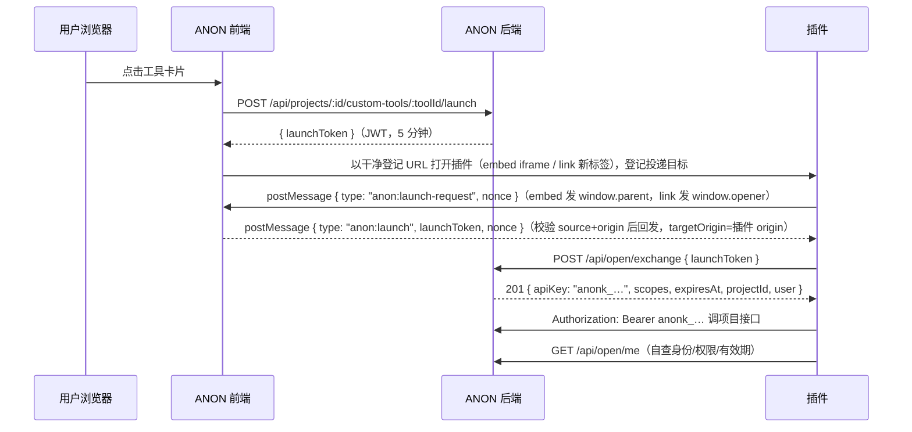

# 插件开发指南（自定义工具 / OpenAPI 模式）

本文面向**自研组件（插件）开发者**：如何把独立部署的 Web 组件接入 ANON 的「工具」Tab，以及如何通过 OpenAPI 模式以用户身份调用 ANON 接口。

- 管理端操作与产品行为见 `docs/features.md`「实用工具 · 自定义工具接入」
- 端点字段级契约见 `docs/api.md`「自定义工具」「OpenAPI（API 密钥）」两章
- 本文聚焦插件侧实现：令牌流转、密钥管理、调用方式与嵌入约束

---

## 1. 两种接入形态

项目管理者（`project:manage` 或 `tools:manage`）在「工具」Tab 点「添加自定义工具」登记你的组件：

| 打开方式 | 行为 | 适用 |
| --- | --- | --- |
| `embed`（嵌入页面内） | 工具页内 iframe 渲染，顶部有「全部工具」返回与「新窗口打开」 | 与主系统强交互的组件 |
| `link`（新标签页） | 点击卡片 `window.open` 新标签（携带身份时保留 opener 通道供握手，见 §2） | 独立完整应用、或禁止被嵌入的站点 |

登记项：名称（≤50）、链接（仅 http/https，≤1000）、描述（≤200）、打开方式、「携带用户身份」开关 + 权限点勾选。

**不带身份的组件**（纯展示/独立工具）到此为止——登记后成员点击即开，无需任何对接。

## 2. OpenAPI 模式：令牌流转

需要读写 ANON 数据（或仅确认当前用户身份）的组件，登记时开启「携带用户身份」。完整链路：



1. **握手接收启动令牌**：用户每次打开工具，ANON 都会签发新的 `launchToken`（5 分钟有效，JWT，kind=`tool-launch` 与用户登录态隔离），但**令牌不进 URL**——插件以干净登记 URL 打开后，由插件前端主动向 ANON 父页面发起 postMessage 握手获取：
   - 请求（插件 → ANON）：`{ type: 'anon:launch-request', nonce: '<8–128 字符随机串>' }`；embed 形态发给 `window.parent`，link 形态发给 `window.opener`；targetOrigin 可用 `*`（请求不含机密）
   - 响应（ANON → 插件）：`{ type: 'anon:launch', launchToken, nonce }`，targetOrigin=工具登记 URL 的 origin。ANON 侧仅向「本次打开已登记的插件窗口 且 origin 匹配登记 URL」回发；插件**必须校验** `event.origin` 为 ANON 源且 `nonce` 与请求一致再使用令牌
   - 拿不到握手通道（无 parent/opener，如用户把插件 URL 直接贴进新标签）时不提供 URL 兜底——提示用户从 ANON 打开，或改用自助 API 密钥（见 §3）
   - 插件前端拿到令牌后交给插件后端（**exchange 必须由插件服务端发起**，见 §5 安全条目）；插件 SPA 重挂载可在 5 分钟内重复发起握手，重发幂等
2. **兑换 API 密钥**：`POST {ANON 源}/api/open/exchange`，body `{ "launchToken": "…" }`。成功 201 返回：
   ```json
   {
     "apiKey": "anonk_<64 位 hex>",
     "expiresAt": "2026-09-16T08:00:00.000Z",
     "scopes": ["todo:create"],
     "projectId": "<项目 id>",
     "user": { "id": "<用户 id>", "name": "昵称" }
   }
   ```
   - `scopes` = **工具登记勾选的权限点 ∩ 该用户当前角色权限**——即「用户打不开的接口，密钥也打不开」。未勾选任何权限点时 `scopes` 为 `[]`：密钥仅能验证身份与读取成员可见数据（各项目域 GET 列表），无任何写权限点
   - **顶替语义**：同一用户在同一工具下重复兑换，旧密钥立即失效（401）。每个打开动作都应重新兑换，不要长期复用旧 key
3. **调用业务接口**：`Authorization: Bearer anonk_…`，密钥绑定 `projectId` 单一项目。可调 `/api/projects/<projectId>/` 下的项目域接口（待办/财务/物料/账号/现场/公告等，契约见 `docs/api.md`），实际放行范围 = `scopes` ∩ 用户实时角色权限（用户被降权/移出项目后，旧密钥同步收窄或失效——每次请求实时求交，无缓存延迟）。
4. **身份自查**：`GET /api/open/me`（仅 API 密钥可调）返回 `{ user, project, permissions, expiresAt }`。`permissions` 为当前实时生效权限点（可与 `scopes` 不同步：用户角色变更后这里变、密钥登记 scopes 不变）。`expiresAt` 为 `null` 表示永久密钥（仅自助生成来源）。

## 3. 密钥生命周期

| 来源 | 有效期 | 顶替代替 | 撤销 |
| --- | --- | --- | --- |
| 工具兑换 | 恒 30 天 | 同 (用户, 工具) 重复兑换顶替旧 key | 工具被删除时级联作废；用户「我的 → API 密钥」可手动撤销 |
| 用户自助生成 | 30 天或永久（生成时选） | 不顶替，按名称自由多把 | 用户手动撤销（硬删除，立即 401） |

- 密钥过期或被撤销后，所有请求 401 `unauthorized`「API 密钥无效或已过期」。插件应识别 401 并提示用户**回到 ANON 重新打开一次工具**（触发新一轮 launch → exchange）
- 服务端只存密钥的 sha256，原文仅 exchange/生成时返回一次——插件侧必须持久化保存（数据库/密钥管理器），丢失只能让用户重新打开工具兑换
- `lastUsedAt` 约每小时粒度回写，可用于审计，不要在热路径上依赖它的实时性

## 4. 边界与错误码

**API 密钥不可达的面**（一律 403 `api_key_forbidden`）：`/api/me`、`/api/admin`、`/api/push`、`/api/invites`、`/api/files`（文件下载）、`POST /api/projects` / `GET /api/projects`（创建与全量列表）、`POST|GET|DELETE /api/open/keys`（密钥不能再造密钥）。文件内容如需给插件用，请走项目域内带鉴权的业务字段或另开通道。

| code | HTTP | 含义与处理 |
| --- | --- | --- |
| `invalid_launch_token` | 401 | 启动令牌无效/过期/kind 不符——引导用户重新从 ANON 打开工具 |
| `unauthorized` | 401 | API 密钥无效/过期/已撤销——重新兑换 |
| `api_key_wrong_project` | 403 | 拿 A 项目的密钥调了 B 项目接口——检查 projectId |
| `forbidden` | 403 | 权限点不足（scopes 未含或用户角色不持有） |
| `api_key_required` | 403 | 用用户 JWT 调了 `/api/open/me` |
| `rate_limited` | 429 | exchange 限流 60 次/15 分钟/IP——正常每次打开兑换一次远低于此 |

统一错误信封：`{ "error": { "code": "…", "message": "人类可读信息" } }`。

## 5. 安全要点（插件侧）

- **握手校验是插件侧责任**：请求 `anon:launch-request` 可用 `*` 作 targetOrigin（消息不含机密，nonce 防串扰）；但响应**必须**校验 `event.origin` 等于 ANON 源且 `nonce` 与请求一致再使用令牌——不校验 origin 等于把令牌接收口开给任意父页面/opener 方
- **无 parent/opener 时**：不提供 URL 兜底（令牌进 URL 会落浏览器历史/Referer/服务器日志/截屏）。提示用户从 ANON 打开工具，或引导其在「个人资料 → API 密钥」自助生成密钥后粘贴进插件配置
- **exchange 放在插件服务端**：launchToken 虽不进 URL，仍是「谁拿到谁兑换」的 5 分钟短效 Bearer 凭证，5 分钟短效 + 一次性用途是底线保护；插件前端握手拿到后应立即转交插件后端兑换。anonk_ 密钥永远不该出现在插件前端代码/ localStorage 以外的可共享位置——插件前端若要调 ANON，也应经插件后端转发
- **HTTPS**：生产环境插件必须 HTTPS。ANON 页面本身是 HTTPS 时，iframe 内嵌 http 会被浏览器混合内容拦截
- **顶替他山之石**：同一用户多点打开同一工具会互相顶替旧 key（后者生效）。插件按 (userId, toolId 或 projectId+user) 存一把 key 即可
- **不要假设权限恒定**：每次关键操作前可 `GET /api/open/me` 确认 `permissions`；写操作被拒（403 `forbidden`）时向用户展示「权限不足」而非重试

## 6. iframe 嵌入约束（embed 形态）

ANON 侧的 CSP 已放行 `frame-src https: http:`，页面内 iframe 配置为：

```
sandbox="allow-scripts allow-same-origin allow-forms allow-popups allow-modals allow-downloads"
allow="clipboard-read; clipboard-write; fullscreen"
```

- 允许：脚本、同源（localStorage/cookie 可用）、表单、弹窗、模态、下载、剪贴板、全屏
- **不允许顶层跳转**（无 `allow-top-navigation`）：插件内 `window.top.location = …` 被静默拦截；需外跳一律 `target="_blank"`
- 你的站点响应头**不得**禁止被嵌：`X-Frame-Options: DENY/SAMEORIGIN` 或 CSP `frame-ancestors` 未含 ANON 域名都会导致 iframe 白屏。正确做法：`Content-Security-Policy: frame-ancestors https://app.anontokyo.design <其他 ANON 部署域>`；不能改头时，登记工具选 `link` 形态
- 携带身份时令牌经握手投递（不进 URL）：iframe 内 `window.parent.postMessage({ type: 'anon:launch-request', nonce }, '*')`，监听 `anon:launch` 回包并校验 origin+nonce，完整代码见 §8

## 7. 权限点清单（登记勾选 / scopes 取值）

| scope | 中文 | 说明 |
| --- | --- | --- |
| `project:manage` | 项目管理 | 等价于项目内全部权限（含下表所有） |
| `member:manage` | 成员管理 | 邀请、改角色、移除 |
| `role:manage` | 角色管理 | |
| `todo:create` | 创建待办 | |
| `todo:manage` | 待办管理 | 增删改任意待办 |
| `todo:complete` | 完成待办 | 完成指派给自己的待办 |
| `file:upload` | 上传文件 | 项目内上传（**注意**：`/api/files/:id` 下载对密钥整体关闭） |
| `finance:manage` | 财务管理 | |
| `finance:add` | 记账 | 仅添加/管理自己添加的账目 |
| `materials:manage` | 物料管理 | |
| `accounts:manage` | 账号管理 | |
| `work:manage` | 现场分工管理 | |
| `announcement:manage` | 公告管理 | |
| `tools:manage` | 工具管理 | 含自定义工具增删改 |
| `lostfound:manage` | 失物招领管理 | |

勾选超出用户实有权限的部分在兑换时被静默收窄（不报错）；`GET /api/open/me` 的 `permissions` 永远反映实时生效集合。

## 8. 最小可用插件示例

插件前端（向 ANON 父页面握手取令牌，校验响应 origin+nonce，转交自家后端）：

```ts
// 插件页面入口
const ANON_ORIGIN = 'https://app.anontokyo.design'; // 或自部署实例源

function requestLaunchToken(): Promise<string | null> {
  const target = window.parent !== window ? window.parent : window.opener;
  if (!target) return Promise.resolve(null); // 非 ANON 打开：提示用户从 ANON 进入，或改用自助 API 密钥
  return new Promise((resolve) => {
    const nonce = crypto.randomUUID();
    const timer = setTimeout(() => {
      window.removeEventListener('message', onMsg);
      resolve(null); // 5s 超时：ANON 侧未登记/已过期
    }, 5000);
    function onMsg(e: MessageEvent) {
      if (e.origin !== ANON_ORIGIN) return; // 必须校验来源
      if (e.data?.type !== 'anon:launch' || e.data.nonce !== nonce) return; // 必须校验 nonce
      clearTimeout(timer);
      window.removeEventListener('message', onMsg);
      resolve(e.data.launchToken as string);
    }
    window.addEventListener('message', onMsg);
    target.postMessage({ type: 'anon:launch-request', nonce }, '*'); // 请求不含机密，可用 *
  });
}

const launchToken = await requestLaunchToken();
if (launchToken) {
  await fetch('/plugin-backend/session', {
    method: 'POST',
    headers: { 'Content-Type': 'application/json' },
    body: JSON.stringify({ launchToken }),
  });
}
```

插件后端（兑换 + 持久化 + 代理业务调用）：

```ts
const ANON = 'https://app.anontokyo.design'; // 或自部署实例源

// POST /plugin-backend/session
async function exchange(launchToken: string) {
  const r = await fetch(`${ANON}/api/open/exchange`, {
    method: 'POST',
    headers: { 'Content-Type': 'application/json' },
    body: JSON.stringify({ launchToken }),
  });
  if (r.status === 401) throw new Error('启动令牌无效或已过期，请从 ANON 重新打开本工具');
  if (!r.ok) throw new Error(`exchange failed: ${r.status}`);
  const d = await r.json(); // { apiKey, expiresAt, scopes, projectId, user }
  await db.apiKeys.upsert(
    { userId: d.user.id, projectId: d.projectId },
    { key: d.apiKey, scopes: d.scopes, expiresAt: d.expiresAt },
  );
  return d;
}

// 业务调用示例：列出待办
async function listTodos(userId: string, projectId: string) {
  const k = await db.apiKeys.get({ userId, projectId });
  const r = await fetch(`${ANON}/api/projects/${projectId}/todos`, {
    headers: { Authorization: `Bearer ${k.key}` },
  });
  if (r.status === 401) throw new Error('密钥已失效，请从 ANON 重新打开本工具');
  return r.json();
}

// 关键操作前自查实时权限
async function myPermissions(key: string): Promise<string[]> {
  const r = await fetch(`${ANON}/api/open/me`, { headers: { Authorization: `Bearer ${key}` } });
  return (await r.json()).permissions;
}
```

## 9. 本地联调

1. 按 `docs/readme.md` 起一套本地实例（Docker compose，唯一端口 `WEB_PORT`，默认 8081）
2. 创建项目 → 「工具」Tab → 添加自定义工具，链接填插件 dev server 地址（如 `http://localhost:5173`——本地 http 页面互相嵌入无混合内容问题），开「携带用户身份」并勾选权限点
3. 打开工具卡片，在插件 DevTools Console 观察握手（先挂 `window.addEventListener('message', e => console.log(e.origin, e.data))`，应看到 `anon:launch` 回包；URL 全程无令牌），走通 exchange → 业务调用
4. 权限收窄/顶替/撤销/过期的断言可参考后端测试 `backend/tests/open.test.ts`（16 个场景的行为基准）
