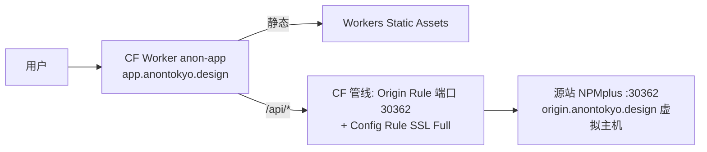

# ANON

ANON 是一个「活动全流程追踪」协作系统，面向展会/同人活动/演出等组织团队。功能：

- **账号与权限**：邀请码注册制（首超管引导）、项目内预置/自定义角色与权限点、成员邀请链接；资源可见范围优先于权限点
- **试用模式**：`TRIAL_EMAIL`（默认 `admin@test.com`）+ 任意 ≥8 位密码登录即建独立演示环境（全模块演示数据），同密码 24h 内复用，到期自动级联销毁；试用期间全站顶部展示「试用」横幅与销毁时间
- **纯前端演示站**：`npm run build:demo` 构建不依赖后端的 Cloudflare Pages 演示站——浏览器内 mock 全部 `/api`（中文示例数据，访客修改会话内保留、关页还原），全站角标 + 横幅标识；部署与 mock 内核原理见 [`docs/demo-site.md`](./demo-site.md)
- **待办**：快速创建 + 按类别分组列表 / 进度时间线（完成前多次提交进度，备注+附件）/ 完成带附件 / 编辑与重新打开 / 模板导入导出 / 到期与节点邮件提醒（cron + SMTP）；`todo:create` 创建权限点
- **通知**：统一通知管线（渠道接口，当前为邮件 + Web Push）：待办指派/改派/完成/新进度、现场任务分配、重要/紧急公告、现场异常上报、新风险、里程碑临近、周报
- **财务**：收支记账、多票种门票盈亏、按人净额与转账建议、CSV 导出
- **物料**：类型 / 多版本 / WebP 预览 / 可见范围
- **账号**：三模式平台账号（完整 / OTP 辅助 / 联系人），浏览器端或服务端加密
- **现场**：任务模块分工（名称/时间/地点/所需人力/分配成员）、成员确认、可打印任务单（含签字栏，浏览器另存 PDF）
- **新手引导 / 内置帮助文档（/help）**：首登欢迎幻灯 + 界面高亮导览（按账号跨设备只弹一次，可重看）；/help 为 7 章图文手册（配真实截图，点击放大）

界面：移动端优先，双风格主题（简洁/明快 × 日/夜），工作台 Tab 与按钮按项目内权限点过滤可见性。

完整接口契约见 [`docs/api.md`](./api.md)；功能使用指南见 [`docs/features.md`](./features.md)；设计说明见 [`docs/design.md`](./design.md)。

## 环境要求

- Node.js 20+
- Docker（**可选**）：`docker compose up -d` 启动 mongo:7 是最省事的本地数据库方式；也可以用任意本地/远程 MongoDB（把 `MONGO_URI` 指过去即可）。后端单元测试使用 `mongodb-memory-server`（devDependency，自动下载内存版 mongod），不依赖 Docker。

## 快速开始

```bash
# 1. 启动 MongoDB（二选一）
docker compose up -d                                  # 方式 A：Docker
# 或者使用任何已有的 MongoDB，记下连接串              # 方式 B

# 2. 配置环境变量
cp backend/.env.example backend/.env
# 按需修改：JWT_SECRET 填随机串；SUPER_ADMIN_EMAIL 设为首个管理员邮箱；
# 如用方式 B，修改 MONGO_URI

# 3. 启动后端（默认 4000 端口）
cd backend && npm install && npm run dev

# 4. 另开终端，启动前端（默认 5173 端口，/api 代理到 4000）
cd frontend && npm install && npm run dev

# 5. 浏览器打开 http://localhost:5173
#    用 SUPER_ADMIN_EMAIL 注册首个账号（无需邀请码，自动成为超管）
#    → 在「管理」页创建邀请码 → 其他用户凭码注册
```

局域网内其他设备访问：`cd frontend && npm run dev -- --host 0.0.0.0`，然后访问 `http://<本机局域网 IP>:5173`（API 由 Vite 代理转发，无需额外开放后端端口）。

## 环境变量（backend/.env）

| 变量 | 必填 | 说明 |
| --- | --- | --- |
| `MONGO_URI` | 是（有默认值 `mongodb://localhost:27017/anon`） | MongoDB 连接串 |
| `JWT_SECRET` | 生产必填（≥32 字符） | JWT 签名密钥；生产环境未配置或不足 32 字符会拒绝启动，开发环境用不安全的默认值 |
| `PORT` | 否 | 后端监听端口，默认 4000 |
| `UPLOAD_DIR` | 否 | 上传文件本地存储目录，默认 `uploads`（已 gitignore）；仅在未配置 S3 时使用 |
| `S3_ENDPOINT` / `S3_BUCKET` / `S3_REGION` / `S3_ACCESS_KEY` / `S3_SECRET_KEY` | 否 | S3 兼容对象存储（MinIO / OSS / AWS S3）。配置 `S3_ENDPOINT` 后上传文件（含预览图）写入 S3，bucket 不存在时自动创建；未配置则回退本地磁盘 `UPLOAD_DIR`。历史本地文件与新 S3 文件可混合读取 |
| `CRON_SECRET` | 提醒功能必填 | cron 提醒接口的 Bearer 密钥；未配置时该接口返回 503 |
| `SUPER_ADMIN_EMAIL` | 否 | 首个超管邮箱：数据库无用户时，该邮箱注册无需邀请码并自动成为超管 |
| `TRIAL_EMAIL` | 否 | 试用模式账号邮箱（默认 `admin@test.com`）：该邮箱 + 任意 ≥8 位密码登录进入独立演示环境（24h 自动销毁）；置空禁用 |
| `SMTP_HOST` / `SMTP_PORT` / `SMTP_USER` / `SMTP_PASS` / `SMTP_FROM` | 否 | SMTP 发信配置；未配置 `SMTP_HOST` 时邮件退化为控制台日志（存根） |
| `VAPID_PUBLIC_KEY` / `VAPID_PRIVATE_KEY` / `VAPID_SUBJECT` | 否 | Web Push 推送（`npx web-push generate-vapid-keys` 生成密钥）；未配置时推送渠道静默禁用，邮件不受影响 |
| `PLATFORM_CRYPTO_KEY` | 否 | 平台账号「服务端加密」模式的密钥源（SHA-256 派生 AES-256-GCM 密钥）；缺省回退 `JWT_SECRET`。浏览器端 ANONv1 加密（默认）不依赖此项 |

## cron 提醒

```bash
curl -X POST -H "Authorization: Bearer $CRON_SECRET" \
  http://localhost:4000/api/cron/reminders
# → {"sent": <本次发送条数>}
```

扫描所有 `status=open` 且 `remindAt <= now`（节点提醒）或 `dueAt <= now`（到期提醒）的待办，经通知管线向指派人发信；每条待办每类提醒只发一次（`ReminderLog` 去重，投递失败不落标记、下次重试）。可挂系统 crontab 每分钟执行。

## 测试与构建

```bash
cd backend  && npm test          # vitest + mongodb-memory-server（无需 Docker/真实 Mongo）
cd backend  && npm run typecheck # tsc --noEmit
cd backend  && npm run build     # tsc 输出到 dist/
cd frontend && npm run build     # vite build（含 tsc --noEmit）
```

生产部署：`npm run build` 后，后端 `node dist/index.js`，前端 `dist/` 为静态文件（任意静态托管或 `npx vite preview`）。

## Docker 部署（镜像构建与一键编排）

仓库自带两套 Dockerfile 与编排文件，可整体容器化部署，无需安装 Node 环境。

**单独构建镜像：**

```bash
docker build -t anon-backend ./backend    # 后端镜像（多阶段：编译 + 生产依赖运行时）
docker build -t anon-frontend ./frontend  # 前端镜像（多阶段：vite build + nginx 托管/代理）
```

**一键编排（推荐）：**

```bash
# 1. 在仓库根目录创建 .env（已 gitignore），至少填 JWT_SECRET（随机长串）
echo "JWT_SECRET=$(openssl rand -hex 32)" > .env
# 可选：SUPER_ADMIN_EMAIL / SMTP_* / CRON_SECRET / PLATFORM_CRYPTO_KEY，同 backend/.env.example

# 2. 构建并启动全部服务（mongo + backend + frontend）
docker compose -f docker-compose.prod.yml up -d --build

# 3. 访问 http://localhost:8080（局域网则 http://<主机IP>:8080）
#    端口冲突时在 .env 里设 WEB_PORT=8081 等改变对外端口
```

架构说明：

- `frontend`（nginx，唯一对外端口 **8080**）：托管前端静态文件，SPA 路由回退，`/api` 反代到 `backend:4000`（上传限 50MB）
- `backend`：不暴露宿主机端口，仅编排网络内可达；未配置 S3 时上传文件存 named volume `uploads-data`
- `minio`：**内嵌对象存储**——S3 兼容 API，文件（含预览图）默认存这里，数据存 named volume `minio-data`；不暴露宿主机端口（API :9000 / 控制台 :9001 仅编排网络内可见）。默认账号 `S3_ACCESS_KEY`/`S3_SECRET_KEY`（缺省 `anon-minio` / `anon-minio-password`，公网部署务必修改）；在 `.env` 覆盖 `S3_*` 可切换外部 S3 服务，设 `S3_ENDPOINT=` 为空则回退本地磁盘且 minio 可不启动
- `ferretdb` + `postgres`：**内嵌数据库（零依赖体验模式）**——FerretDB v2 提供 MongoDB 协议，后端存储为 PostgreSQL（DocumentDB 扩展），数据存 named volume `pg-data`；均不暴露宿主机端口
- **数据库两级配置**：默认走内嵌 FerretDB（账号 `DB_USER`/`DB_PASSWORD`，缺省 `anon` / `anon-dev-password`，公网部署务必修改）；**外接 MongoDB 优先**——在 `.env` 设置 `MONGO_URI` 即改用外部库，`postgres`/`ferretdb` 两服务可删除或不启动
- 编排项目名为 `anon-prod`，与开发用 `docker-compose.yml`（仅 mongo，端口 27017）互不干扰，可并存
- 常用命令：`docker compose -f docker-compose.prod.yml logs -f backend`（看日志）/ `down`（停止）/ `down -v`（停止并清空数据卷，慎用）
- cron 提醒：容器外执行 `curl -X POST -H "Authorization: Bearer $CRON_SECRET" http://localhost:8080/api/cron/reminders`（经前端代理）

## Cloudflare Workers 边缘部署（外网入口）

在源站（上述 Docker 编排）已公网可达的前提下，`worker/` 目录把前端静态资产托管到 Cloudflare 全球边缘，`/api/*` 反代回源站，对外提供统一 HTTPS 入口：



生产入口：**https://app.anontokyo.design**（workers.dev 子域国内不可达，仅备用）

```bash
cd frontend && npm run build            # 先出最新 dist
cd ../worker && npm install             # 仅首次
CLOUDFLARE_API_TOKEN=... CLOUDFLARE_ACCOUNT_ID=... npm run deploy
# -> https://anon-app.<subdomain>.workers.dev
```

要点：

- `deploy` 脚本会把 `frontend/dist` 拷成 `.deploy-assets/` 并剔除 `_redirects`（Pages 专用，与 SPA `not_found_handling` 组合会触发 CF API 无限重定向校验，code 100324），再 `wrangler deploy`
- `/api` 反代时显式写 `X-Forwarded-For: <cf-connecting-ip>`，保证后端登录限流按真实客户端 IP 计数（否则全员共享 CF 出口 IP 配额）
- 静态响应的安全头（CSP/nosniff/XFO 等）在 `worker/src/index.js` 复刻自 `frontend/nginx.conf`——改 nginx 安全头时两边同步
- **回源链（同 zone 约束的完整解法）**：Worker 绑 `app.anontokyo.design` 后与源站域名同属一个 zone，Worker 子请求强制走 CF 边缘管线，不支持 `:30362` 非常用端口直连，且 Host 头改写需 Enterprise。落地方案四件套：DNS `origin.anontokyo.design` CNAME → `anon.anontokyo.design`（橙云，跟随 DDNS IP）+ Origin Rule（该主机名 destination port → 30362，Free 套餐唯一开放的回源改写）+ Configuration Rule（该主机名 SSL=Full，源站 30362 为 TLS）+ 源站 NPMplus 为 `origin.anontokyo.design` 配虚拟主机（转发与应用相同；Full 不校验证书，无需配 SSL）。`wrangler.toml [vars].ORIGIN = https://origin.anontokyo.design`；换源站/回源走 Tunnel 时改这里
- **wrangler.toml 不写 routes**：自定义域名绑定存于 CF 侧 Workers Domains；写 routes 会触发 wrangler 对 zone workers/routes 的读对账，要求额外的 Zone Workers Routes 权限
- 绑新自定义域名：Dashboard -> Workers -> anon-app -> Domains 添加，token 需补 Workers Routes: Edit
- 与 Pages 演示站（`anon-19b.pages.dev`，纯前端 mock）互不干扰；本 Worker 代理的是**真实后端**，无独立数据
- 所需 token 权限：Account Workers Scripts: Edit；Zone Origin Rules / DNS / Config Rules: Edit（回源链规则维护）

## 安全

- **会话**：access JWT 15 分钟有效，refresh token 30 天滚动（每次刷新轮换，库中只存 sha256，单用户上限 10 个），退出登录即吊销。旧 30 天 JWT 在部署后仍有效直至自然过期（同一 JWT_SECRET），前端会自动走刷新流程续期。
- **登录限流**：`/api/auth/*`（注册/登录/试用登录/refresh/logout）每 IP 15 分钟最多 50 次，防撞库与试用环境资源消耗。
- **安全响应头**：nginx 对静态页下发 CSP（无 unsafe-inline 脚本，主题初始化脚本已外置 `theme-init.js`）、`X-Content-Type-Options`、`X-Frame-Options`、`Referrer-Policy`、`Permissions-Policy`；`server_tokens off` 隐藏版本号。
- **权限化审计日志**：实物清单数量变动/状态变更需 `materials:manage`，无权限成员看不到「变动记录」入口。
- **文件预览收敛**：仅位图（png/jpeg/webp/gif）内联预览；SVG 等可携带脚本的格式不生成预览、下载走 `Content-Disposition: attachment`。
- **非 root 容器**：backend（node 用户）与 frontend（`nginxinc/nginx-unprivileged`，监听 8080）均不以 root 运行。
- **依赖面**：multer 2.x（修复 CVE-2025-47935/47944）、vite 6.4+（修复 CVE-2026-39365，dev-server 路径穿越）、nodemailer 9.x、react-router 7.18+。
- **依赖扫描 CI**：`.github/workflows/dependency-scan.yml` 用 osv-scanner（v2.4.0 固定版本 + SHA256 校验）扫描 backend/frontend 锁文件，push 涉及依赖变更时触发 + 每周一全量兜底；豁免清单在根目录 `osv-scanner.toml`（每条附原因，当前仅 GHSA-qwww-vcr4-c8h2——react-router RSC 模式专属、本项目纯 SPA 不可达，修复需 React 19 待整体升级解除）

### 公网部署必须做的三件事

1. **终止 TLS**：本仓库 nginx 仅监听明文端口，公网部署应在前面加反向代理（Caddy/nginx/certbot）终止 HTTPS。
2. **修改默认口令**：内嵌 FerretDB 的 `DB_PASSWORD`、MinIO 的 `S3_ACCESS_KEY`/`S3_SECRET_KEY` 均有开发默认值，公网部署必须用强随机值覆盖（`.env`）。
3. **JWT_SECRET 至少 32 字符**：`openssl rand -hex 32` 生成，生产启动校验。

### 既有部署升级的一次性迁移

后端容器改为非 root（node 用户，UID 1000）运行后，早期以 root 初始化的 `uploads-data` 卷需要一次属主迁移（否则 multer 写入 EACCES）：

```bash
docker compose -f docker-compose.prod.yml stop backend
docker run --rm -v anon-prod_uploads-data:/data alpine chown -R 1000:1000 /data
docker compose -f docker-compose.prod.yml up -d --build backend frontend
```

仅对已有部署执行一次；全新部署无需执行。

## 端到端冒烟

核心 curl 流程（后端已启动时）：

```bash
# 1. 首超管注册（无邀请码）
curl -X POST localhost:4000/api/auth/register -H 'Content-Type: application/json' \
  -d '{"email":"admin@test.com","name":"Admin","password":"password123"}'
# → 201 {"token":"...","user":{"email":"admin@test.com","isSuperAdmin":true,...}}

# 2. 建邀请码
curl -X POST localhost:4000/api/admin/invite-codes \
  -H "Authorization: Bearer $TOKEN" -H 'Content-Type: application/json' -d '{}'
# → 201 {"id":"...","code":"ANON-XXXXXXXX"}

# 3. 第二用户凭码注册 → 4. 建项目 → 5. 建邀请 → 6. 第二用户接受
# 7. 建待办（assigneeIds=[第二用户], dueAt=过去时间）
# 8. POST /api/projects/:id/todos/:todoId/complete（curl -F completionNote=... -F files=@file）
# 9. GET /api/projects/:id/todos/template/export → POST .../template/import
# 10. POST /api/cron/reminders -H "Authorization: Bearer $CRON_SECRET" → {"sent":0}
# 11. GET /api/files/:id -H "Authorization: Bearer $TOKEN" → 200 文件流
```

## 备注

- 「可见范围」（物料类型/资源、平台账号）优先于权限点；File 模型的预留字段仍未启用。
- 前端技术栈：Vite + React + TypeScript + Tailwind CSS v4（`@tailwindcss/vite`）+ shadcn/ui（`frontend/components.json`，new-york / neutral）+ lucide-react + sonner；主题双风格（简洁/明快 × 日/夜）保存在本机 localStorage（`anon-theme` / `anon-style`）。
- 运维约束：新增 shadcn 组件必须使用 `npx shadcn@3`（v4 CLI 移除了 `--base-color` 参数，与当前 `components.json` 不兼容）。
- `backend/uploads/` 与 `backend/.env` 均已 gitignore，勿提交。
- `/help` 帮助文档的界面截图存于 `frontend/public/help/`；界面变动后用 Playwright 重生成：`PLAYWRIGHT_BROWSERS_PATH=<浏览器目录> node frontend/scripts/capture-help-screenshots.mjs`（需前端 dev 服务器运行中）。
